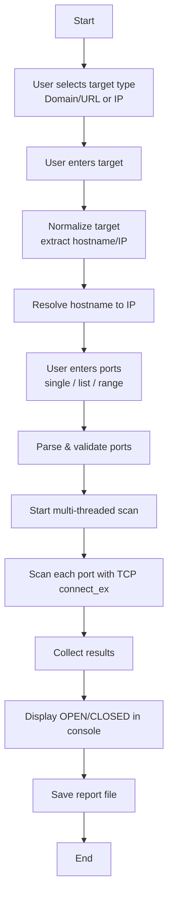

# Python Network Port Scanner

- Scan **specific ports** or **port ranges**.
- Accept **URL, domain, or IP** as target (e.g. `http://example.com`, `example.com`, `192.168.1.10`).
- Resolve the host to an IP and run a **TCP connect scan**.
- Show results in the terminal and save a **detailed text report**.

## Features

- 🔍 Scan **domain / URL / IP** (e.g. `http://example.com`, `example.com`, `192.168.1.10`).
- 🎯 Choose **exact ports**: single, multiple, ranges, or mixed input.
- ⚡ Uses **multi-threading** for faster scanning.
- 📄 Generates a **scan report file** for documentation.
- 🧠 Clear console output with **OPEN/CLOSED** status.
- 🧩 Clean, well-structured Python code for learning:
  - URL parsing (`urllib.parse`)
  - DNS resolution (`socket.gethostbyname`)
  - TCP connect scanning (`socket.connect_ex`)
  - Thread pools (`concurrent.futures.ThreadPoolExecutor`)
  - File I/O and basic logging

---

## How it works (High‑level)

1. **User input**
   - Choose target type: **Domain/URL** or **IP address**.
   - Enter target (e.g. `http://example.com` or `192.168.1.10`).
   - Enter ports to scan (e.g. `80`, `80,443,8080`, `1-1024`, or a mix).
   - Optional: adjust timeout per port.

2. **Normalization & resolution**
   - If URL is given, the script extracts the **hostname** using `urllib.parse`.
   - It resolves the hostname to an **IPv4 address** using `socket.gethostbyname`.

3. **Port parsing**
   - User port input is parsed and validated (1–65535).
   - Supports lists and ranges in a single string.

4. **Port scanning**
   - Uses a **TCP connect scan** (`socket.connect_ex`) to check if each port is open.
   - Uses a **thread pool** to scan multiple ports concurrently.

5. **Results & report**
   - Displays results in the terminal.
   - Writes a **text report** with time, target, IP, and per‑port status.

---

## Project Structure

```text
.
├── smart_port_scanner.py   # Main script
└── README.md               # This documentation
```

When you run a scan, the script also creates a report file like:

```text
scan_report_example_com.txt
scan_report_192_168_1_10.txt
```

---

## Requirements

- Python 3.8+ (tested with Python 3)
- No external libraries required (only Python standard library)

---

## Installation

1. **Clone this repository**

```bash
git clone https://github.com/<your-username>/Network-Scan-And-Ports-Advanced.git
cd Network-Scan-And-Ports-Advanced
```

2. **Check Python version**

```bash
python --version
# or
python3 --version
```

Make sure it shows **Python 3.x**.

---

## Usage

### Basic run (interactive)

```bash
python smart_port_scanner.py
# or on some systems
python3 smart_port_scanner.py
```

You will see a banner and simple menu:

1. Choose target type:
   - `1` = Domain / URL (e.g. `http://example.com`)
   - `2` = IP address (e.g. `192.168.1.10`)

2. Enter target:
   - Example: `http://example.com`
   - Example: `example.com`
   - Example: `192.168.1.10`

3. Enter port(s) to scan:

Examples:

- Single port  
  `80`

- Multiple ports  
  `80,443,8080`

- Range of ports  
  `1-1024`

- Mixed (ports and ranges)  
  `22,80,443,8000-8100`

4. Enter timeout per port (seconds):

- Press Enter for default: `0.5`
- Or type a custom value, e.g. `1.0`

The script will then:

- Show `OPEN` or `closed` for each port.
- Summarize open ports at the end.
- Save a report file, e.g.:

```text
scan_report_example_com.txt
```

---

## Example

### Example 1 – Scan HTTP/HTTPS on a domain

**Input:**

- Target type: `1` (Domain/URL)  
- Target: `http://example.com`  
- Ports: `80,443`  
- Timeout: `0.5`

**Console output (example):**

```text
[+] Normalized Host: example.com
[+] Resolved IP    : 93.184.216.34

[+] Starting scan on 93.184.216.34
[+] Number of ports: 2
[+] Timeout/port   : 0.5 seconds

Scan results:
-------------
[OPEN ] Port 80
[closed] Port 443

[+] Open ports found: 80

[+] Report saved to: scan_report_example_com.txt
```

---

## Internal Design

### 1. Target handling

- `normalize_target(target: str) -> str`  
  - Accepts URL, domain, or IP string.  
  - Uses `urllib.parse.urlparse` to extract hostname when needed.  
  - Falls back to a simple split as backup.

- `resolve_host(host: str) -> str`  
  - Uses `socket.gethostbyname` to resolve hostname to IPv4 address.  
  - Exits with a clear error message if resolution fails.

### 2. Port parsing

- `parse_ports(port_input: str) -> List[int]`  
  - Accepts `80`, `80,443`, `1-1024`, `22,80,443,8000-8100`.  
  - Validates range `[1, 65535]`.  
  - Removes duplicates and returns a sorted list.

### 3. Scanning logic

- `scan_single_port(ip: str, port: int, timeout: float)`  
  - Creates a TCP socket: `socket.socket(AF_INET, SOCK_STREAM)`.  
  - Sets timeout: `s.settimeout(timeout)`.  
  - Uses `s.connect_ex((ip, port))`:
    - `0` = success → port **OPEN**.
    - Non-zero = error → port **CLOSED** (or filtered/unreachable in this basic model).

- `scan_ports(ip: str, ports: List[int], timeout: float, workers: int)`  
  - Uses `ThreadPoolExecutor` to scan multiple ports in parallel.  
  - Collects and sorts results as `(port, is_open)`.

### 4. Reporting

- `save_report(target_str, host, ip, results, filename)`  
  - Saves:
    - Timestamp
    - Original input
    - Host and resolved IP
    - Per-port status
    - Summary with open-port list

---

## Flowchart (Scan Process)

> This Mermaid diagram shows the basic workflow of the scanner.


The author is **not responsible** for any misuse or illegal activity done with this tool.

Always obey your local laws and your organization’s security policies.
